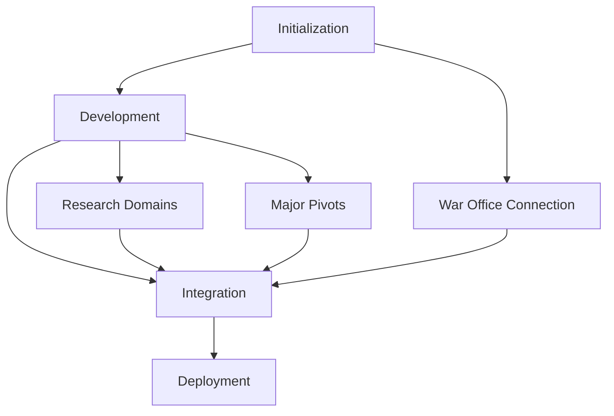

# R&D Phase Coordination Document

## Phase Overview

### 1. Initialization Phase
- Foundation establishment
- System configuration
- Basic infrastructure

### 2. Development Phase
- Component creation
- System refinement
- Testing protocols

### 3. Integration Phase
- System connection
- Component harmony
- Performance optimization

### 4. Deployment Phase
- Systematic rollout
- Validation processes
- Scale management

## Phase Dependencies

## Current Status

### Completed
- Exchange system operational
- Block-001 deployment (Labscapes 001-016)
- Initial validation protocols

### In Progress
- Planning documentation updates
- War Office connection setup
- Research domain implementation

### Pending
- New major pivots integration
- Block-002 deployment
- Extended validation frameworks

## Critical Path

1. Complete planning documentation
2. Establish War Office connection
3. Implement research domains
4. Integrate major pivots
5. Resume block deployments

## Risk Management

### Technical Risks
- System integration challenges
- Performance bottlenecks
- Security vulnerabilities

### Operational Risks
- Deployment delays
- Resource constraints
- Communication issues

### Mitigation Strategies
- Regular validation
- Continuous monitoring
- Proactive adjustment

## Success Criteria

### Phase Completion
- Documentation updated
- Systems operational
- Validation passed
- High Command approval

### Overall Success
- 256 labscapes deployed
- Full system integration
- Performance optimized
- Security verified

## Next Steps

1. Update planning documentation
2. Configure War Office connection
3. Implement research domains
4. Integrate major pivots
5. Resume block deployment

## Notes

- Maintain systematic approach
- Regular documentation updates
- Continuous validation
- Security compliance